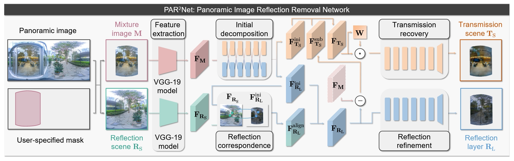
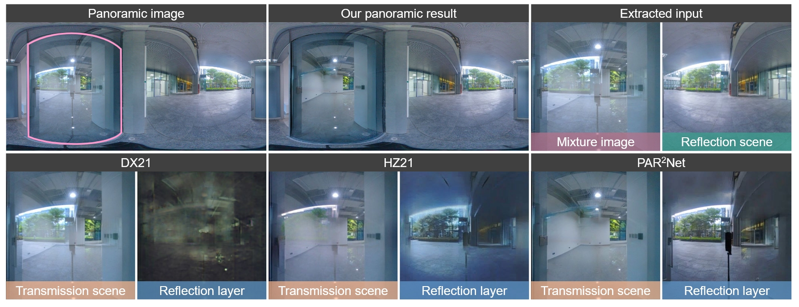

# PAR<sup>2</sup>Net: End-to-end Panoramic Image Reflection Removal (TPAMI 2023)

## Network architecture



## Results



## Testing

1. Prepare data at `./data`, each group of data should contain a panoramic image `color.jpg` and a mask image `mask.jpg` (glass regions at value `1`, others at `0`)

2. Download the [pre-trained model](https://pan.baidu.com/s/155oWKoTTrdwhDBb3VsHZrA?pwd=PANO) at `./model`

3. Run the test code `python test.py`

## Citation

If you find the papers are useful for your research, please cite our papers as follows:

```
@inproceedings{hong2021panorr,
  title={Panoramic image reflection removal},
  author={Hong, Yuchen and Zheng, Qian and Zhao, Lingran and Jiang, Xudong and Kot, Alex C. and Shi, Boxin},
  booktitle={Proceedings of the IEEE/CVF Conference on Computer Vision and Pattern Recognition},
  year={2021}
}

@article{hong2023par2net,
  title={{PAR$^2$Net}: End-to-end Panoramic Image Reflection Removal},
  author={Hong, Yuchen and Zheng, Qian and Zhao, Lingran and Jiang, Xudong and Kot, Alex C. and Shi, Boxin},
  journal={IEEE Transactions on Pattern Analysis and Machine Intelligence},
  year={2023},
  volume={45},
  number={10},
  pages={12192-12205}
}
```